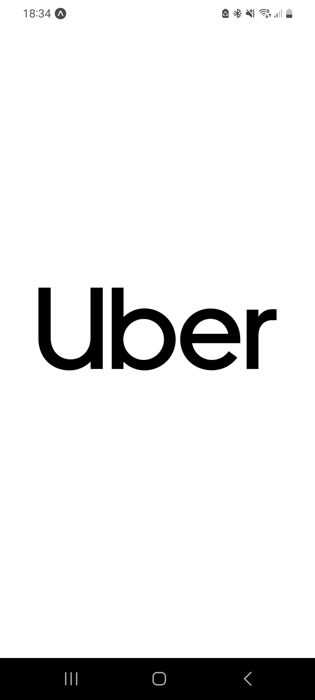
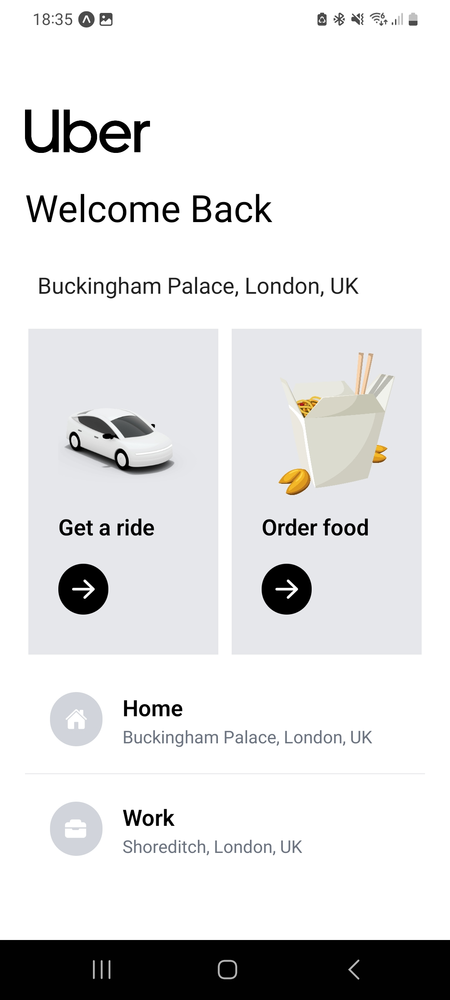
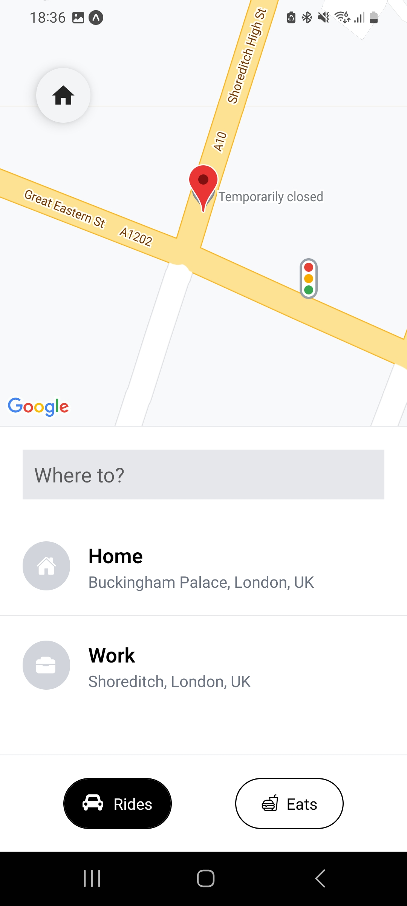
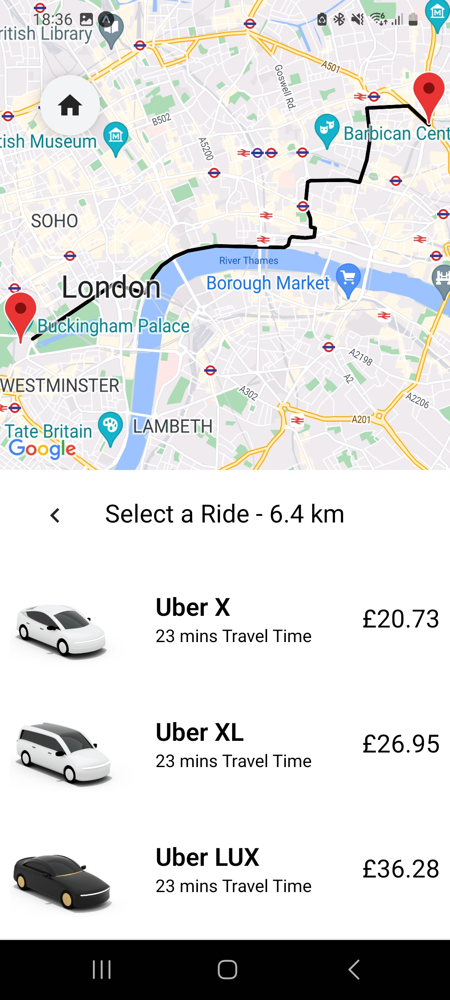

# Uber Clone

This project is an Uber clone, built with Expo, React Native and several other modern mobile development technologies. It showcases a simple replica of Uber's mobile UI.

## Screenshots









## Technologies Used

Here are the core technologies used in the development of this project:

- **Expo**: An open-source platform for making universal native apps for Android, iOS, and the web with JavaScript and React.
- **React Native**: A JavaScript framework for writing real, natively rendering mobile applications for iOS and Android.
- **React Navigation**: Routing and navigation for your React Native apps.
- **Redux Toolkit**: The official, opinionated, batteries-included toolset for efficient Redux development.

Other notable libraries include:

- **react-native-elements**: Cross-platform React Native UI Toolkit.
- **react-native-google-places-autocomplete**: Customizable Google Places autocomplete component for iOS and Android React-Native apps.
- **react-native-maps**: React Native Mapview component for iOS and Android.
- **react-native-maps-directions**: Directions component for react-native-maps.
- **react-native-vector-icons**: Customizable Icons for React Native with support for NavBar/TabBar, image source and full styling.

## Installation

You need to have Node.js, npm, and Expo CLI installed on your machine. Once you have these, follow the steps:

1. Clone this repository:

   ```git clone https://github.com/apetta/uber-clone.git```

2. Navigate to the project directory:

   ```cd uber-clone```

3. Install the dependencies:

   ```npm install```

4. Create a .env file in the root directory and add your Google Maps API key (you can get one [here](https://developers.google.com/maps/documentation/javascript/get-api-key)):

   ```
   GOOGLE_MAPS_APIKEY=your_google_maps_api_key
   ```

5. Start the Expo server:

   ```expo start```

6. Open the app on your device with Expo Go by scanning the QR code that appears in the terminal or in the browser. (Note: If there's an issue loading the app, try reloading it by pressing `r` in the terminal)


